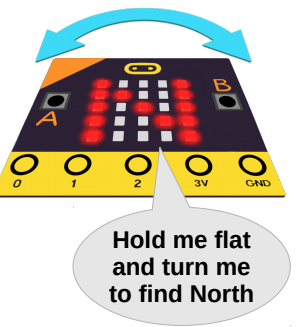

# microbit
Tasks for learning physical computing with the microbit
MicroBit  

# The Compass
Note that the magnetometer needs to be calibrated before use. This is done by tipping the micro:bit around to draw a circle on the LEDs. Be aware that sometimes the magnetometer calibration can be affected by the magnetic fields emanating from an electronic device, such as a computer.

Follow the instructions on this page to learn about the magnetometer, - http://microbit-challenges.readthedocs.io/en/latest/tutorials/compass.html 

# Challenge
Make your microbit display the letters "N', "E", "S" and "W" when the microbit is pointing North, East, South and West respectively. 

## Starter code ##
    from microbit import *

    compass.calibrate()

    while True:
    sleep(100)
    #put the compass reading into a variable
    val = compass.heading()
    
    #check the value of the variable against known
    #values for N, S, E and W and display appropriate image
    if (val .......... ):
      display.show('N')
    else:
      display.show(Image.NO)
